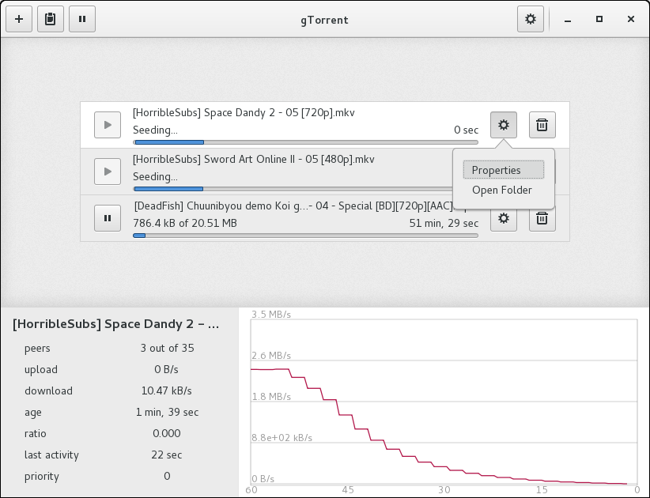
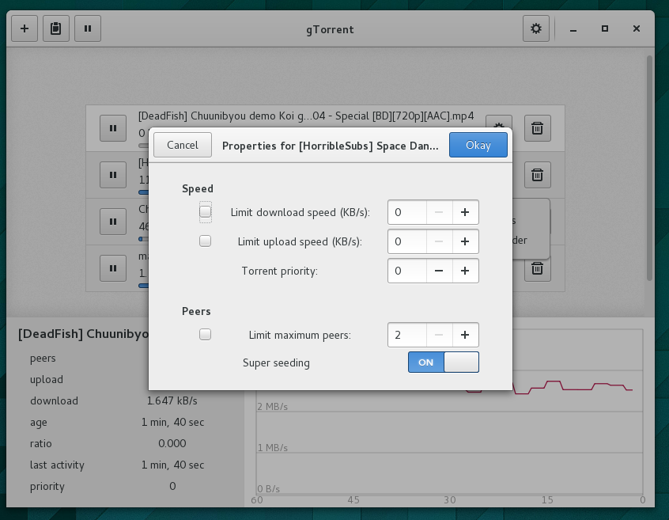

gtorrent
========








Fork of original gTorrent, with everything written in straight C, save the 
wrapper to libtorrent-rasterbar, which is written in C++. This repo has no 
distinction between `gtorrent-core` and `gtorrent-gtk`; everything is in one 
program. This is intended to be nothing more than a standalone application 
without emphasis on unnecessary "modularity" (eg. having gtorrent-core).

[Here is a list of remaining items.](TODO.md)

## Dependencies
I haven't put in a suitable dependency satisfaction tool in yet for this repo, 
so there isn't much useful debug output when trying to build things the first 
time. These should be the necessary libs:
* GTK+ 3.13 or newer
* boost (boost-system)
* [libtorrent-rasterbar](http://www.rasterbar.com/products/libtorrent/) 1.0.0 or newer

Both may be easily installed on a standard \*nix machine, but if not (or if 
using Windows), you may have to compile either.

## Building
This project uses GNU Make, so it can be built quickly (assuming all of the
dependencies have first been satisfied) with
```
$ make
```
